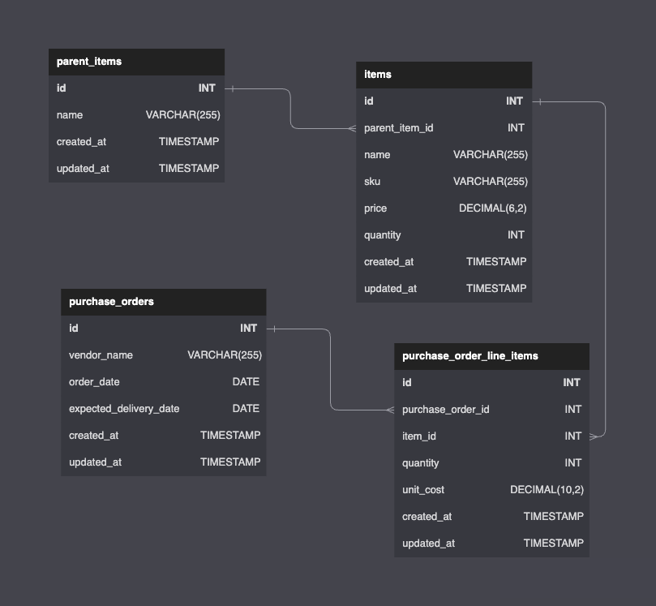

<pre>
   ___                _    ___              __        __ _
  / _ \___   ___   __| |  /   \__ _ _   _  / _\ ___  / _| |___      ____ _ _ __ ___
 / /_\/ _ \ / _ \ / _` | / /\ / _` | | | | \ \ / _ \| |_| __\ \ /\ / / _` | '__/ _ \
/ /_\\ (_) | (_) | (_| |/ /_// (_| | |_| | _\ \ (_) |  _| |_ \ V  V / (_| | | |  __/
\____/\___/ \___/ \__,_/___,' \__,_|\__, | \__/\___/|_|  \__| \_/\_/ \__,_|_|  \___|
                                    |___/
                       xkOO00OOkxx                   xkOOOOOOkxx
                   xk0KNNWMMMMWWNX0kx             kOKXNWWMMMMWNXKOx
                  kKNWMMWWWNNNWWMMMWXOx         kKNWMMMWWNNNWWMMMWX0x
                x0NMMMWX0Okxxkk0KNMMMWKk      xONWMMWX0OkkxkkOKNWMMWXk
               x0NWMWXOx         kKWMMWKk     ONMMMXOx         k0NMMWXk
               ONMMWXk            x0WMMW0    kXWMMXk             0WMMWKx
               0WMMW0              kXMMMKx   ONMMW0x             kXMMMXk
               0WMMW0              kXMMMKx   ONMMW0x             kXMMWXk
               kXMMMXk            xKWMMW0    kXWMMNO            x0WMMW0x
               xONMMWXOx        xkKWMMWKx     ONMMMN0x        xkKWMMWKk
                xONWMMWXKOOkkkO0XWMMMN0x       OXWMMWNK0OkkkO0KNMMMWKk
                  k0NWMMMMWWWWWMMMWNKkx         x0XWMMMMWWWWWMMMMWXOx
                    xOKXNWWWWWWNXK0kx             xO0XNWWWWWWNXK0kx
                       xxkkOOOkkx                    xxkOOOOkkx
               xk0K0k                                           xOKKOx
               OXWMWNK0kx                                   xkOKNWMWN0x
               xOKNWMMWWNK0OOkxxx                    xxkkO0KXNWMMWNX0k
                  kOKXNWMMMMWWNXXKKK00000OOOO0000KKKXXNWWMMMMWWNK0kx
                     xkO0KXNNWWMMMMMMMMMMMMMMMMMMMMMMMWWWNXK0Okx
                          xxkOOO0KKKXXXXXXXXXXXXXKKK00OOkxx
                                     xxxxxxxxxxx
</pre>

### Coding Exercise

We are building software for brands that sell their products online. We will provide software to them to manage purchase orders, allocate stock from these purchase orders that will be pushed up to the sales  update their inventory levels. This coding exercise is meant to explore these concepts to give each candidate an idea of what real world problems we are looking to solve, to give us a chance to see what it’s like to work together, all while assessing the candidates development skills.

### Your Development Environment
You will be running this on your local machine, using the IDE you are comfortable using. Please treat this like a real world scenario, and use the tools and resources you would normally use.

You will need to be running node 19 or higher. There is an `.nvmrc` file in the project. If you have nvm installed, you can run `nvm use` to switch to the correct version. 

### Requirements
It's likely we won't complete every requirement, but let's get as far as we can in the allotted time.

- Ability to see a list of purchase orders, create, and edit them
- Sensible validation for creation and editing of fields
- Error handling for the validation

### Starting Point

- Monorepo with NestJS and NextJS powered application
- Seeded database

### To Start Exercise
 - Run `npm install --global nx@latest`
 - Run `npm install`
 - Run `nx run api:serve:development`
 - Run `nx run client:serve:development`

### Schema
Here is the schema we will use for this exercise.

 - `parent_items` are the parent of `items`. Example: t-shirt or pants
 - `items` represent variations of items that we can sell. Example: t-shirt in red or blue
 - `purchase_orders` represent the document we use to track variants we are ordering from vendors.
 - `purchase_order_line_items` represent the line items on a purchase order, and are linked to variants.

### Explorations
Once the requirements above have been completed, let's spend some time exploring the following:

- It's important to understand the cost of goods sold in order to understand our profit margin. Costs for each item can vary per purchase order. Let's talk through how we would implement this.
- Let's say a merchant's online store is able to only sell inventory that is on hand. In other words, inventory that the merchant has at their fulfillment center. Let’s talk through how we would implement presale / backorder to sell goods that they have on order from a vendor.
